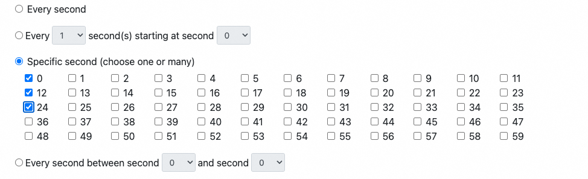

# 什么是 Quartz Cron Expressions

Cron Expressions（Cron 表达式）是用来展示时间集合的字符串。在不同的系统或者框架上，Cron Expressions 的标准会有所差异。对于
Quartz Cron Expressions 来说，它被用来配置 CronTrigger 实例，由空格隔开分7个子表达式：

1. Seconds （秒）：范围为0-59的整数，可出现, - * /四个字符;
2. Minutes（分）：范围为0-59的整数，可出现, - * /四个字符;
3. Hours （时）：范围为0-23的整数，可出现, - * /四个字符;
4. Day-of-Month（日）：范围为1-31的整数，需要注意所选月的总日数，可出现, - * /? L W C八个字符;
5. Month（月）：范围为0-11的整数，或者使用字符串JAN、FEB、MAR、APR、MAY、JUN、JUL、AUG、SEP、OCT、NOV 和 DEC。可出现, - * /四个字符;
6. Day-of-Week （周几）：范围为1-7 (1 为周日) ，或者使用字符串 SUN、MON、TUE、WED、THU、FRI 和 SAT。，可出现, - * /? L W C八个字符;
7. Year (年，可选)，可出现, - * /四个字符;

> 例如，Cron Expressions 字符串 0 0 12 ? * WED表示“每个星期三的12点”。

其中表达式中特殊字符的含义为：

+ 通配符*可以被用来表示域中“每个”可能的值。因此在”Month”域中的*表示每个月，而在 Day-Of-Week 域中的*则表示“周中的每一天”。
+ /字符用来表示值的增量，例如, 如果分钟域中放入0/15，它表示“从0开始,每隔15分钟”，如果在分钟域中使用3/20，则表示“从第3分钟开始，每隔20分钟”或者另外相同的形式就是3,23,43。
+ ?字符可以用在 day-of-month 及 day-of-week 域中，它用来表示“没有指定值”。这对于需要指定一个或者两个域的值而不需要对其他域进行设置来说相当有用。
+ L字符可以在 day-of-month 及 day-of-week 中使用，这个字符是”last”的简写，但是在两个域中的意义不同。例如，在 day-of-month
  域中的L表示这个月的最后一天，即，一月的31日，非闰年的二月的28日。如果它用在 day-of-week 中，则表示7或者SAT。但是如果在
  day-of-week 域中，这个字符跟在别的值后面，则表示”当月的最后的周XXX”。例如：”6L” 或者
  “FRIL”都表示本月的最后一个周五。当使用L选项时，最重要的是不要指定列表或者值范围，否则会导致混乱。
+ W字符用来指定距离给定日最接近的周几（在 day-of-week 域中指定）。例如：如果你为 day-of-month 域指定为15W,则表示“距离月中15号最近的周几”。
+ #表示表示月中的第几个周几。例如：day-of-week 域中的6#3或者FRI#3表示“月中第三个周五”。
+

## 例子

下面是几个常见的 Quartz Cron Expressions 例子：

+ 0 0/5 * * * ?: 每隔5分钟触发一次
+ 10 0/5 * * * ?: 在每分钟的10秒后每隔5分钟触发一次的表达式(例如. 10:00:10 am, 10:05:10等.)。
+ 0 30 10-13 ? * WED,FRI: 在每个周三和周五的 10：30，11：30，12：30 触发。
+ 0 0/30 8-9 5,20 * ?: 在每个月的5号、20号的8点和10点之间每隔半个小时触发一次且不包括10点，只是8：30，9：00和9：30的表达式。
+ 

## 表达式

| 名称           | 是否必须 | 允许的值             | 特殊字符            |
|--------------|------|------------------|-----------------|
| Seconds      | 是    | 0-59             | , - * /         |
| Minutes      | 是    | 0-59             | , - * /         |
| Hours        | 是    | 0-23             | , - * /         |
| Day-of-Month | 是    | 1-31             | , - * ? / L W C |
| Month        | 是    | 1-12或者JAN-DEC    | , - * /         |
| Day-of-Week  | 是    | 1-7或者SUN-SAT     | , - * ? / L W C |
| Year         | 否    | empty或者1970-2099 | , - * /         |